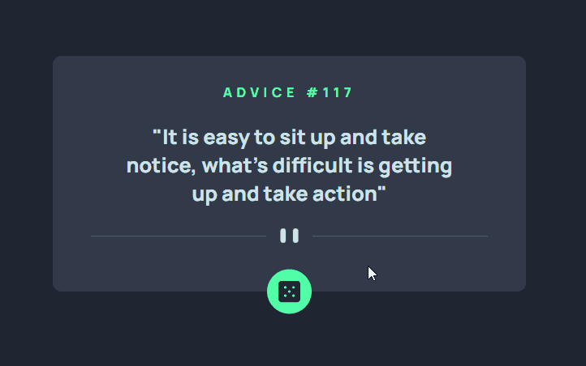
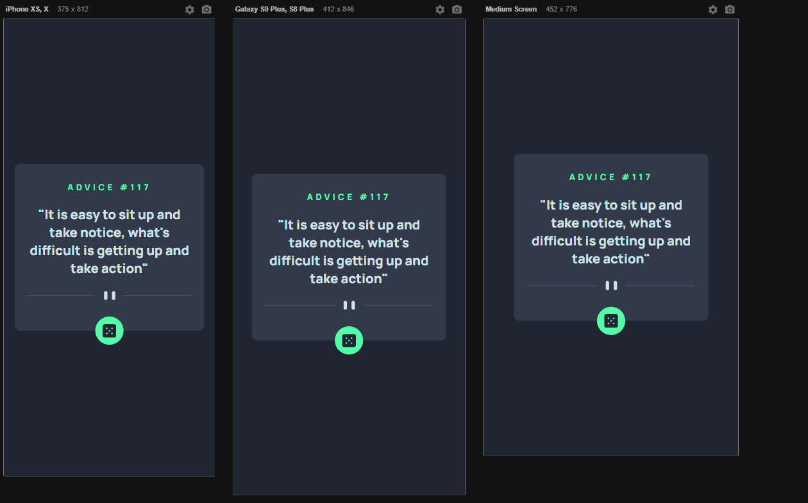

# Frontend Mentor - Profile card component solution

This is a solution to the [Advice generator app challenge on Frontend Mentor](https://www.frontendmentor.io/challenges/advice-generator-app-QdUG-13db).
#
Essa é a solução para o [Advice generator app challenge on Frontend Mentor](https://www.frontendmentor.io/challenges/advice-generator-app-QdUG-13db).

## Conteúdos

- [Visao Geral](#visao-Geral)
  - [Sobre o desafio](#sobre-o-desafio)
  - [Screenshot](#screenshot)
- [Sobre o processo](#sobre-o-processo)
  - [Ferramentas utilizadas](#ferramentas-utilizadas)
  - [O que eu aprendi](#o-que-eu-aprendi)
- [Autor](#autor)

## Visao Geral

### Sobre o desafio

- Fazer um layout responsivo para o site.
- Utilizar uma API para a geração de conselhos.
- Estilizar o dado com o hover e cada vez que o usuário interagir com ele atualizar o conselho e o seu ID 

### Screenshot
#### Desktop Screenshot

#### Responsive Viewer

## Sobre o processo

### Ferramentas utilizadas

- HTML 
- Estilização com CSS
- Flexbox
- CSS Grid
- Responsividade
- JavaScript (API)

### O que eu aprendi

Aprendi como utilizar API's dentro do JavaScript.

## Autor

- Linkedin - [Daniel Borguezani](https://www.linkedin.com/in/daniel-borguezani-903460223/)
- Frontend Mentor - [@Borguezani](https://www.frontendmentor.io/profile/Borguezani)
- GitHub - [@Borguezani](https://github.com/Borguezani)

